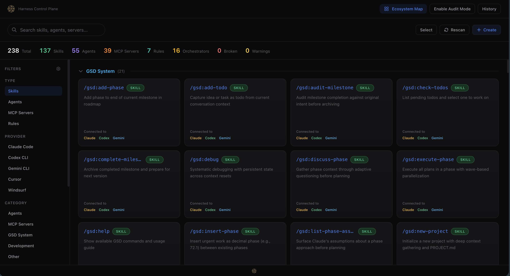
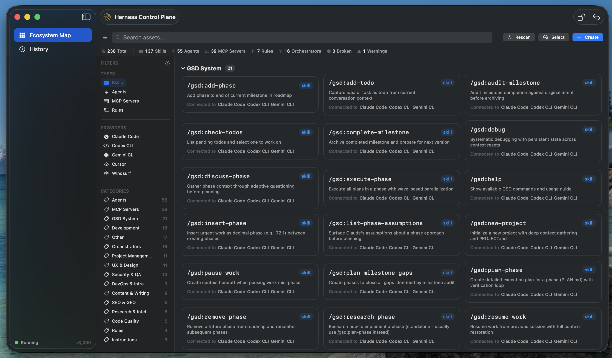

# Harness Control Plane

[](https://www.npmjs.com/package/harness-control-plane)
[](LICENSE)
[](#beta-notice)

**One dashboard to rule all your AI coding tools.** Discover, manage, and sync skills, agents, MCP servers, and rules across Claude Code, Codex CLI, Gemini CLI, Cursor, Windsurf, GitHub Copilot, and Continue.dev. Copy an agent from Claude to Codex in one click. See what's connected where. Keep everything in sync.

<p align="center">
  
</p>

<p align="center">
  
</p>

## Why

You use multiple AI coding assistants. Each has its own config format, its own directory, its own way of defining skills, agents, and rules. You wrote a great prompt for Claude Code — now you want it in Codex and Gemini too. You added an MCP server to one project — where else is it configured?

Harness Control Plane answers all of that. It auto-discovers everything, shows you the full picture, and lets you connect assets between tools with a single click (via symlinks — no duplication, always in sync).

## Two Ways to Use

| | **macOS App** | **CLI / Web UI** |
|---|---|---|
| **Install** | [Download DMG](https://github.com/spyrae/harness-control-plane/releases/latest) | `npx harness-control-plane` |
| **Best for** | Local daily use | VPS, remote, headless |
| **UI** | Native SwiftUI | React SPA in browser |
| **Agent** | Auto-launches on start | Manual `hcp` command |

## Supported Tools

| Tool | What HCP scans |
|------|--------------|
| **Claude Code** | `~/.claude/commands/`, `~/.claude/agents/`, `~/.claude/rules/`, `.mcp.json`, `CLAUDE.md` |
| **Codex CLI** | `.codex/skills/`, `.codex/agents/`, `.codex/mcp.json`, `AGENTS.md` |
| **Gemini CLI** | `.gemini/skills/`, `.gemini/mcp.json`, `GEMINI.md` |
| **Cursor** | `.cursor/rules/`, `.cursorrules` |
| **Windsurf** | `.windsurf/rules/`, `.windsurf/mcp.json`, `.windsurfrules` |
| **GitHub Copilot** | `.github/copilot-instructions.md` |
| **Continue.dev** | `.continue/config.json` |

## Key Features

### Ecosystem Map
- **Auto-discovery** across 7 AI coding tools, local and remote
- **Filterable sidebar** — by type, provider, category. Hide what you don't need, settings persist
- **Smart search** — find any asset by name, description, or tags
- **Auto-categorization** — Development, DevOps, Security, Content, SEO, UX, and more

### Connect & Sync
- **One-click connect** — share a Claude skill with Codex and Gemini instantly
- **Symlink-based** — no file duplication, edit once and all tools see the update
- **Disconnect** any time — clean removal, no orphaned files
- **Source protection** — original files can't be accidentally deleted from connected targets

### Create & Import
- **Create** new skills, agents, MCP servers, and rules from the UI
- **Import from file** — drag in an existing `.md`, `.json`, or `.yaml` — type auto-detected
- **Edit inline** — modify file content with save/revert directly in the app
- **Delete** with downstream impact warnings (shows what will break)

### History & Rollback
- **Full audit trail** — every create, connect, disconnect, delete is logged
- **One-click undo** — revert the last change
- **Rollback any entry** — restore a specific historical state
- **Approval tracking** — records who made each change and from which client

### Real-Time
- **File watcher** — config changes detected instantly
- **WebSocket sync** — UI updates live across web and macOS
- **SQLite persistence** — state survives restarts

## Quick Start

### macOS App

Download from [GitHub Releases](https://github.com/spyrae/harness-control-plane/releases/latest), open the DMG, drag to Applications. Requires Node.js (`brew install node`).

### CLI

```bash
npx harness-control-plane
```

Opens the web UI at `http://localhost:3000`.

### Install Globally

```bash
npm install -g harness-control-plane
hcp                    # Start web UI
```

## Usage

```bash
# Web UI (default)
hcp                        # Start on port 3000, open browser
hcp -p 8080                # Custom port
hcp --headless             # API only, no UI (for VPS)
hcp --no-open              # Don't auto-open browser

# Static HTML (one-shot)
hcp scan                   # Print summary to stdout
hcp scan -o map.html       # Generate self-contained HTML file
```

### VPS / Remote

```bash
# On your VPS:
hcp --headless -p 3000

# Access from local machine:
ssh -L 3000:localhost:3000 user@your-vps
open http://localhost:3000
```

## Keyboard Shortcuts

| Shortcut | Action |
|----------|--------|
| `Cmd+F` | Focus search |
| `Cmd+N` | Create new asset |
| `Cmd+R` | Rescan ecosystem |
| `Cmd+Z` | Undo last change |
| `Escape` | Close panel / clear search |

## Architecture

```
harness-control-plane/
├── bin/cli.js          # CLI entry (hcp command)
├── agent/
│   ├── server.js       # HTTP + WebSocket server
│   ├── router.js       # REST API (50+ endpoints)
│   ├── scanner/        # Multi-tool asset discovery
│   ├── connector/      # Connect/disconnect via symlinks
│   ├── sync.js         # Cross-provider sync engine
│   ├── health.js       # Asset health checks
│   ├── drift.js        # Drift detection across copies
│   ├── snapshots.js    # Rollback snapshots
│   └── store/          # SQLite persistent state
├── desktop/            # macOS SwiftUI app (Xcode)
├── ui/                 # React + TypeScript + Tailwind
└── template/           # Static HTML fallback
```

## API

All endpoints under `/api/`. Full CRUD for assets, projects, servers, bundles, and policies.

| Endpoint | Method | Description |
|----------|--------|-------------|
| `/api/assets` | GET | List assets (filters: type, provider, category, q) |
| `/api/assets/create` | POST | Create new asset |
| `/api/assets/:id/content` | GET/PUT | Read/update content |
| `/api/connect` | POST | Connect asset to a tool |
| `/api/disconnect` | POST | Disconnect from a tool |
| `/api/rescan` | POST | Full ecosystem rescan |
| `/api/history` | GET | Audit trail |
| `/api/undo` | POST | Undo last change |

WebSocket at `/ws` pushes `assets:updated` events on any file change.

## Beta Notice

> **This is a beta release (v0.1.0).** Core functionality is stable and tested, but expect rough edges. Some features (Projects, Servers, Bundles, Policies views) are hidden in the UI while being finalized. If you encounter bugs, please [open an issue](https://github.com/spyrae/harness-control-plane/issues).

## Contributing

Contributions are welcome! This project is open for:

- **Bug reports** — [open an issue](https://github.com/spyrae/harness-control-plane/issues) with reproduction steps
- **Feature requests** — describe your use case, we'll discuss
- **Pull requests** — fork, branch, make changes, open a PR
- **New provider support** — want to add support for Aider, Roo Code, or another tool? PRs welcome
- **Documentation** — improvements to README, API docs, or inline comments

### Development

```bash
git clone https://github.com/spyrae/harness-control-plane.git
cd harness-control-plane
npm install
npm run dev          # Start agent without opening browser
npm run dev:ui       # Start Vite dev server for UI hot-reload
```

macOS app: open `desktop/AEM.xcodeproj` in Xcode, build & run.

## Requirements

- **macOS App**: macOS 14+, Node.js >= 18
- **CLI**: Node.js >= 18, any OS
- At least one AI coding tool configured

## License

[BSL 2.0](LICENSE) — free to use, modify, and self-host. Cannot be sold as a competing product. Converts to MIT on 2030-04-06.

---

Built by [@spyrae](https://github.com/spyrae). If you find this useful, star the repo.
